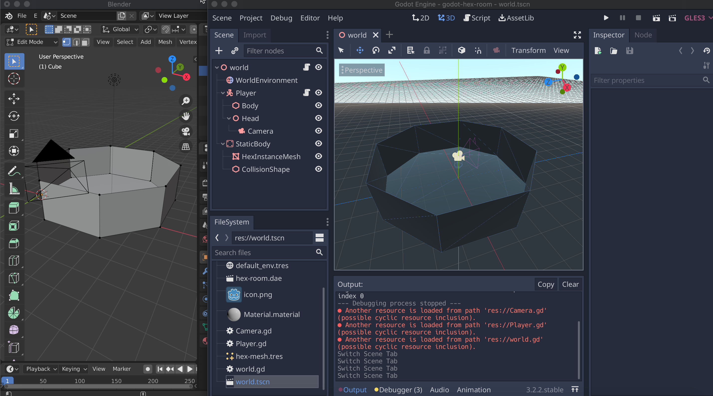

# Hex Room

A simple prototype to figure out how to import an image from Blender into Godot

References:
- [Learn How to Prototype Levels In Blender](https://www.youtube.com/watch?v=2Y2WwvOwn4w)
- [Blender to Godot 3: Low Poly Scene Import](https://www.youtube.com/watch?v=2Y2WwvOwn4w)
- [Godot - First Person Controller Tutorial Part 1](https://www.youtube.com/watch?v=Etpq-d5af6M)
- [Godot - First Person Controller Tutorial Part 2 - Basic Movement](https://youtu.be/Mxuj7fjKvbI)
- [How to set a mesh as a collision shape](https://godotengine.org/qa/45050/how-to-set-a-mesh-as-a-collision-shape)

